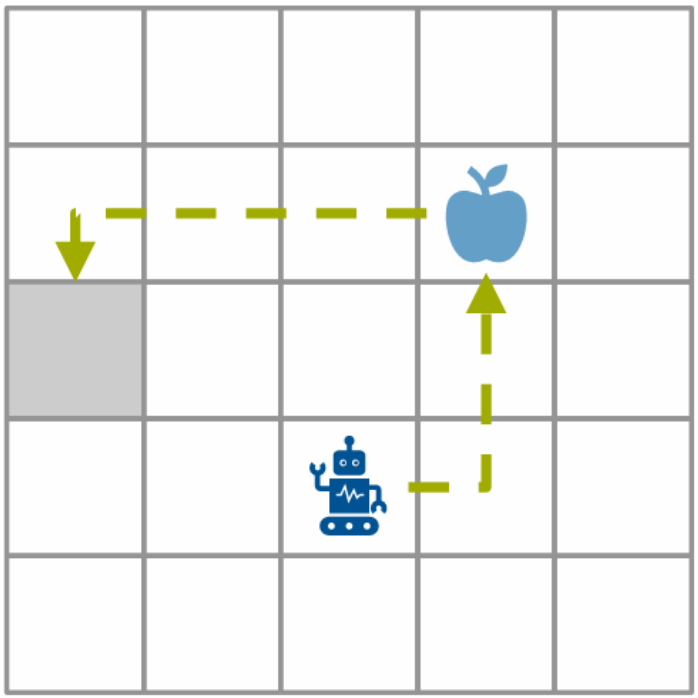
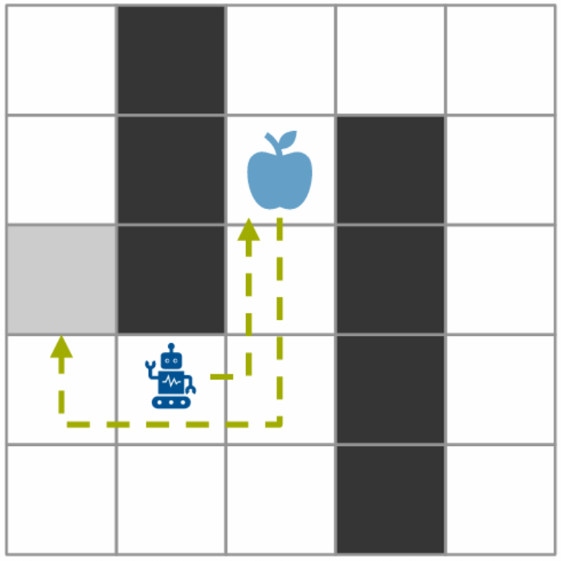

# Ducks Riding Lamas - Reinforcement Learning Project

## Project Overview

This project evaluates Deep Q-Network (DQN), Proximal Policy Optimization (PPO), and Soft Actor-Critic (SAC) in a stochastic 5×5 grid-based pickup-and-delivery environment. The task involves collecting and delivering dynamically spawning items under time constraints, sparse rewards, and spatial restrictions across three environment variants. The repository includes feature-engineered state representations, reward shaping strategies, and tuned agent configurations to analyze performance, training stability, and generalization across increasingly complex settings.

<p align="center">
  
  
</p>

### Key Features
- **Multiple RL Algorithms**: Support for SAC (Soft Actor-Critic), DQN, and A2C agents
- **Flexible Network Architectures**: MLP, CNN, and combined network options
- **Three Environment Variants**: Different difficulty levels and configurations
- **Experiment Tracking**: Integration with Weights & Biases (W&B) for monitoring
- **Prioritized Experience Replay**: Optional PER for improved learning efficiency
- **Comprehensive Testing**: Training, validation, and final testing modes

---

## Project Structure

```
ducks-riding-lamas/
├── agent_sac/                    # SAC agent implementation
├── agent_dqn/                    # DQN agent implementation
├── agent_ppo/                    # PPO agent implementation
├── env/                          # Environment implementation
│   └── environment.py            # Grid world environment
├── data/                         # Training data (variant_0, variant_1, variant_2)
├── models/                       # Trained model checkpoints (.keras files)
├── test_data/                    # Test episodes for evaluation
├── plots/                        # Generated visualization plots
├── main.py                       # Main training/testing script
├── config.py                     # Command-line argument configuration
├── greedy.py                     # Greedy baseline agent
├── pixi.toml                     # Pixi environment configuration
└── requirements.txt              # Python dependencies
```

---

## Prerequisites

- **Python**: 3.11.x (tested with 3.11.9)
- **Pixi**: Package and environment manager for Python (https://pixi.sh)

---

## Setup Instructions

### 1. Clone the Repository

```bash
git clone https://github.com/fivecodingfive/ducks-riding-lamas.git
cd ducks-riding-lamas
```

### 2. Install Pixi

Follow the installation guide at [pixi.sh](https://pixi.sh) for your operating system (Windows, macOS, or Linux).

### 3. Install Dependencies

Once Pixi is installed, run:

```bash
pixi install
```

This creates a managed environment with all dependencies pinned to exact versions.

### 4. Activate the Environment

**Option A: Interactive Shell**
```bash
pixi shell
```

**Option B: Run Commands Directly with Pixi**
```bash
pixi run python main.py [arguments]
```

---

## Usage

### Pre-configured Tasks

```bash
pixi run train          # Run main training script
pixi run test           # Run test policy evaluation
pixi run greedy         # Run greedy baseline agent
```

---

### Training

Train an agent using SAC (default):
```bash
pixi run python main.py --mode training --variant 0 --episodes 400 --network mlp
```

### Validation

Validate a trained model:
```bash
pixi run python main.py --mode validation --modelpath models/my_model.keras
```

### Final Testing

Evaluate a trained model on test data:
```bash
pixi run python main.py --mode "final testing" --modelpath models/my_model.keras --episodes 100
```

### Available Arguments

```
--variant {0, 1, 2}         Environment variant (default: 0)
--mode {training, validation, testing, final testing}
--episodes INT              Number of episodes (default: 100)
--network {mlp, cnn, combine}  Network architecture (default: mlp)
--algorithm {sac, dqn, a2c}    RL algorithm (default: sac)
--modelpath PATH            Path to model file (default: models/example_model.keras)
--learning_rate FLOAT       Learning rate (default: 0.001)
--alpha FLOAT               SAC entropy regularization (default: 0.4)
--per {0, 1}                Use prioritized experience replay (default: 1)
--seed INT                  Random seed (default: 42)
--batch_size INT            Batch size (default: 64)
--sweep_id INT              Hyperparameter sweep index (default: None)
```


## Monitoring Training

The project integrates with **Weights & Biases** for experiment tracking. Training metrics are automatically logged including:
- Episode rewards
- Q-values and losses
- Actor/Critic losses
- Learning rate changes
- Entropy values

View results at https://wandb.ai after logging in with your W&B account.

## Notes

- Models are saved in `.keras` format (Keras 3 native format)
- Experiment configurations are logged to W&B for reproducibility
- All random operations are seeded for reproducibility (set via `--seed`)
- The environment supports multiple variants with increasing complexity
